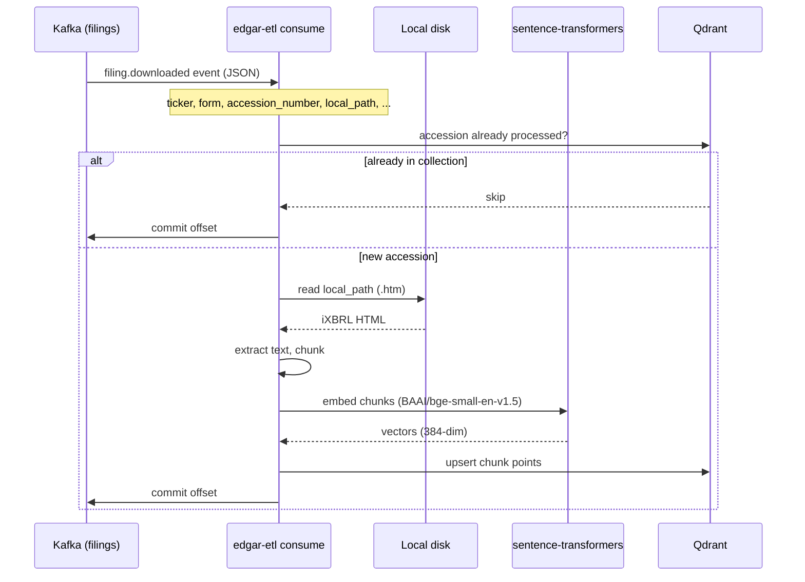
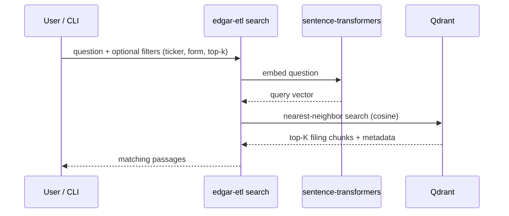

# SEC EDGAR Filings → Qdrant

Transform and load SEC EDGAR filings into [Qdrant](https://qdrant.tech/) for semantic search.

This service listens to Kafka for `filing.downloaded` events, reads filings from the **local filesystem** (it does not download from SEC), extracts text from inline XBRL HTML, generates embeddings, and stores them in Qdrant.

Companion project: [sec-edgar-filings-to-pgvector](https://github.com/sanjuthomas/sec-edgar-filings-to-pgvector) (same pipeline, PostgreSQL + pgvector backend).

## Quick start

```bash
git clone https://github.com/sanjuthomas/sec-edgar-filings-to-qdrant.git
cd sec-edgar-filings-to-qdrant

python3 -m venv .venv && source .venv/bin/activate
pip install -e ".[dev]"
cp .env.example .env

docker compose up -d              # Qdrant on :6333, data at /Volumes/Transcend/qdrant-data
edgar-etl init-collection
edgar-etl process-event --json examples/sample-event.json   # offline test
edgar-etl consume               # Kafka consumer (when Kafka is running)
```

## Data flow

This service consumes events produced by [sec-edgar-filings](https://github.com/sanjuthomas/sec-edgar-filings)
after filings are downloaded to local disk. It does not call SEC EDGAR directly.

### Ingest (Kafka → Qdrant)



### Query (semantic search)



## What this project does / does not do

| In scope | Out of scope |
|----------|--------------|
| Consume Kafka events | Download filings from SEC EDGAR |
| Read files from `local_path` | LLM-generated answers (RAG chat) |
| Extract, chunk, embed, load | SEC rate limiting / User-Agent handling |

## Prerequisites

- **Python 3.11+**
- **Qdrant** (Docker recommended)
- **Kafka** (only for `consume` mode)
- Local EDGAR filing files (e.g. `/Volumes/Transcend/edgar/...`)

### Qdrant (Docker)

Data is persisted to `/Volumes/Transcend/qdrant-data`:

```bash
docker compose up -d
```

Qdrant dashboard: http://localhost:6333/dashboard

REST API: http://localhost:6333

## Installation

```bash
git clone https://github.com/sanjuthomas/sec-edgar-filings-to-qdrant.git
cd sec-edgar-filings-to-qdrant

python3 -m venv .venv
source .venv/bin/activate
pip install -e ".[dev]"

cp .env.example .env
# Edit .env if needed
```

Initialize the Qdrant collection:

```bash
edgar-etl init-collection
```

## Configuration

Copy `.env.example` to `.env`:

```env
QDRANT_URL=http://localhost:6333
QDRANT_COLLECTION=filing_chunks

KAFKA_BOOTSTRAP_SERVERS=localhost:9092
KAFKA_TOPIC=filings
KAFKA_GROUP_ID=edgar-etl
KAFKA_AUTO_OFFSET_RESET=earliest

EMBEDDING_MODEL=BAAI/bge-small-en-v1.5
EMBEDDING_BATCH_SIZE=32
EMBEDDING_DIMENSION=384

CHUNK_SIZE=1000
CHUNK_OVERLAP=150

LOG_LEVEL=INFO
```

| Variable | Description |
|----------|-------------|
| `QDRANT_URL` | Qdrant REST API URL |
| `QDRANT_COLLECTION` | Collection name for filing chunks |
| `KAFKA_TOPIC` | Topic to consume (e.g. `filings`) |
| `KAFKA_GROUP_ID` | Consumer group for offset tracking |
| `KAFKA_AUTO_OFFSET_RESET` | `earliest` = start from offset 0 for new groups |
| `EMBEDDING_MODEL` | Hugging Face model (384 dimensions) |
| `CHUNK_SIZE` / `CHUNK_OVERLAP` | Text splitting parameters |

## CLI commands

All commands are run via `edgar-etl`:

```bash
edgar-etl init-collection                         # Create collection + indexes
edgar-etl consume                                 # Start Kafka consumer
edgar-etl consume --group-id edgar-etl-replay     # Replay topic from offset 0
edgar-etl process-event --json path/to.json       # Process one event offline
edgar-etl process-file --file ... --ticker ...    # Process one local file
edgar-etl search "your question" --top-k 5        # Semantic search
edgar-etl status                                  # Point count in collection
```

### Kafka consumer

Consumes from the configured topic starting at the earliest offset when the consumer group has no committed offsets:

```bash
edgar-etl consume
```

- Commits Kafka offsets **only after** successful embed + Qdrant write
- Skips filings already in the collection (by `accession_number`)
- Use `--force` on `process-event` / `process-file` to reprocess

#### Replay the entire topic

Kafka tracks offsets per **consumer group**. To read from the beginning, pass a **new** group name that has never consumed the topic:

```bash
edgar-etl consume --group-id edgar-etl-replay
```

Each new `--group-id` starts at the earliest offset (`KAFKA_AUTO_OFFSET_RESET=earliest` by default). Already-loaded filings are skipped unless you also pass `--force`:

```bash
edgar-etl consume --group-id edgar-etl-replay --force
```

You can also set the default group in `.env` instead of using the flag:

```env
KAFKA_GROUP_ID=edgar-etl-replay
```

### Process a single filing (no Kafka)

```bash
edgar-etl process-event --json examples/sample-event.json
```

```bash
edgar-etl process-file \
  --file /Volumes/Transcend/edgar/AEE/000110465926063184/tm2614913d1_8k.htm \
  --ticker AEE \
  --company-name "AMEREN CORP" \
  --form 8-K \
  --accession-number 0001104659-26-063184 \
  --filing-date 2026-05-14
```

## Kafka event format

```json
{
  "event_type": "filing.downloaded",
  "schema_version": 1,
  "ticker": "A",
  "company_name": "AGILENT TECHNOLOGIES, INC.",
  "filing_date": "2026-06-01",
  "form": "10-Q",
  "accession_number": "0001090872-26-000055",
  "local_path": "/Volumes/Transcend/edgar/A/000109087226000055/a-20260430.htm",
  "document_url": "https://www.sec.gov/Archives/edgar/data/1090872/000109087226000055/a-20260430.htm",
  "downloaded_at": "2026-06-16T17:28:23.652799Z"
}
```

## Qdrant schema

Single collection **`filing_chunks`** — one point per text chunk:

| Payload field | Description |
|---------------|-------------|
| `content` | Text chunk |
| `accession_number`, `chunk_index` | Stable identity (UUID point id derived from these) |
| `ticker`, `company_name`, `form`, `filing_date` | From Kafka event |
| `local_path`, `document_url` | File location and SEC URL |
| `section` | ITEM header when detected |
| `chunk_count`, `processed_at` | Filing-level metadata on each point |

Vector: **384 dimensions**, cosine distance. Keyword indexes on `accession_number`, `ticker`, and `form`.

## Querying (semantic search)

Embed your question with the **same model** used at load time, then find the nearest chunks.

```bash
edgar-etl search "Who was elected director at Ameren?" --ticker AEE --top-k 5
edgar-etl search "revenue growth" --form 10-Q --top-k 10
edgar-etl search "executive compensation approval"
```

**`--top-k N`** returns the **N most similar** chunks (default: 5). Higher `score` = better match (cosine similarity).

### Full Q&A with an LLM

`search` returns source passages, not a synthesized answer. For natural-language answers:

1. Retrieve chunks with `edgar-etl search`
2. Send chunks + question to an LLM (Ollama, OpenAI, etc.)

## Project layout

```
sec-edgar-filings-to-qdrant/
├── pyproject.toml
├── docker-compose.yml
├── .env.example
├── examples/sample-event.json
├── src/edgar_etl/
│   ├── cli.py                 # CLI entry point
│   ├── consumer.py            # Kafka consumer
│   ├── extract.py             # iXBRL HTML extraction + chunking
│   ├── embed.py               # sentence-transformers
│   ├── store.py               # Qdrant upsert
│   ├── query.py               # Semantic search
│   └── pipeline.py            # Orchestration
└── tests/
```

## Tech stack

| Layer | Library |
|-------|---------|
| Kafka | confluent-kafka |
| HTML parsing | BeautifulSoup + lxml |
| Embeddings | sentence-transformers (`BAAI/bge-small-en-v1.5`) |
| Vector DB | qdrant-client |
| Config | pydantic-settings |

## Tests

```bash
pytest
```

Extraction tests use the sample 8-K at `/Volumes/Transcend/edgar/AEE/...` if the file is available.

## Troubleshooting

| Problem | Fix |
|---------|-----|
| `Connection refused` on Qdrant | Run `docker compose up -d` |
| `filing not found` | External drive unmounted or wrong `local_path` in Kafka event |
| Poor search results | Use the same `EMBEDDING_MODEL` for load and search |
| Reprocess a filing | `edgar-etl process-event --json ... --force` |
| Replay Kafka from start | `edgar-etl consume --group-id <new-name>` |
| Replay and re-embed all filings | Add `--force` to the replay command above |
