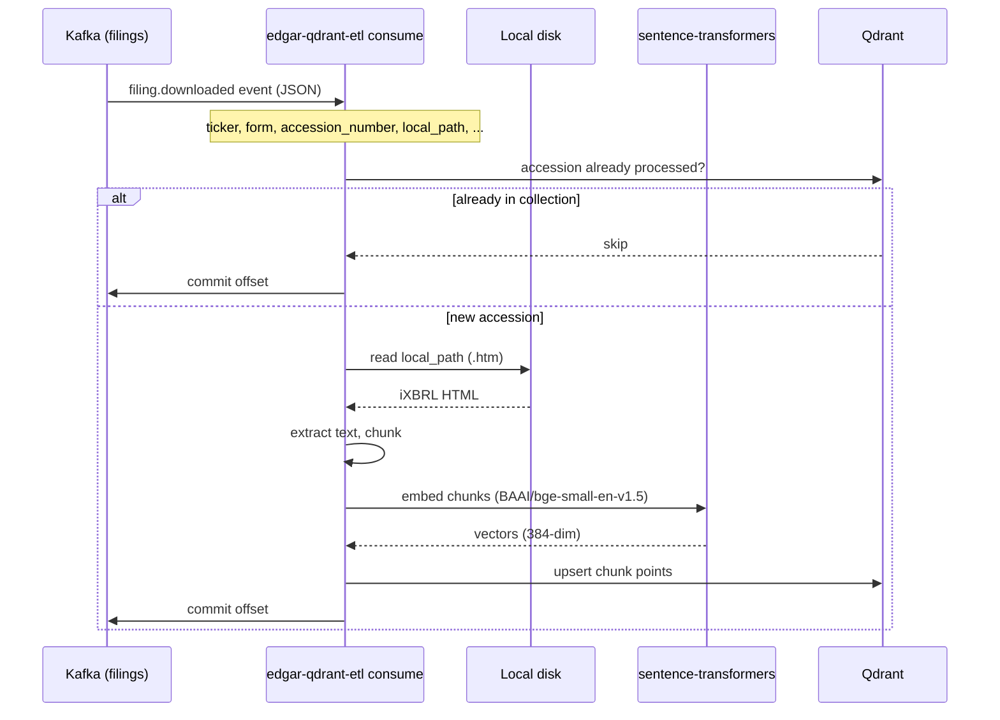
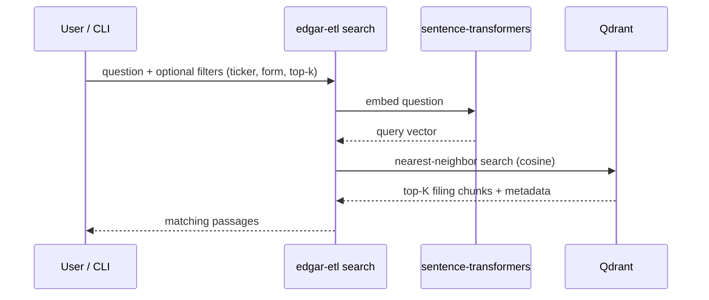
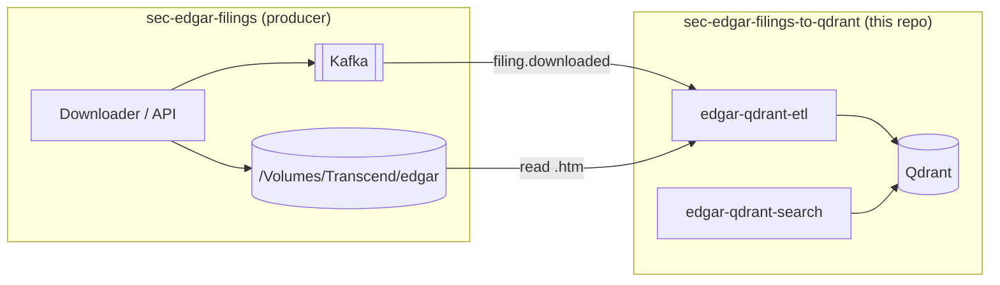

# SEC EDGAR Filings → Qdrant

Transform and load SEC EDGAR filings into [Qdrant](https://qdrant.tech/) for semantic search.

This service listens to Kafka for `filing.downloaded` events, reads filings from the **local filesystem** (it does not download from SEC), extracts text from inline XBRL HTML, generates embeddings, and stores them in Qdrant.

Companion project: [sec-edgar-filings-to-pgvector](https://github.com/sanjuthomas/sec-edgar-filings-to-pgvector) (same pipeline, PostgreSQL + pgvector backend).

## Quick start (Docker)

**1. Start the producer stack** (Kafka, downloader) from [sec-edgar-filings](https://github.com/sanjuthomas/sec-edgar-filings):

```bash
git clone https://github.com/sanjuthomas/sec-edgar-filings.git
cd sec-edgar-filings
cp .env.example .env   # set SEC_USER_AGENT
docker compose up -d
docker compose --profile jobs run --rm download-sp500   # optional: fetch filings
```

**2. Start this consumer stack** (Qdrant + ETL + search UI):

```bash
git clone https://github.com/sanjuthomas/sec-edgar-filings-to-qdrant.git
cd sec-edgar-filings-to-qdrant
mkdir -p /Volumes/Transcend/qdrant-data
cp .env.example .env
docker compose up -d --build
docker compose run --rm edgar-qdrant-etl edgar-etl init-collection   # first time only
docker compose ps
```

**3. Verify**

```bash
docker compose logs -f edgar-qdrant-etl    # should connect to kafka:9092
open http://localhost:8000                  # semantic search UI
open http://localhost:6333/dashboard       # Qdrant dashboard
```

See [Web UIs](#web-uis) for what each interface is for.

## Data flow

This service consumes events produced by [sec-edgar-filings](https://github.com/sanjuthomas/sec-edgar-filings)
after filings are downloaded to local disk. It does not call SEC EDGAR directly.

### Ingest (Kafka → Qdrant)



### Query (semantic search)



## What this project does / does not do

| In scope | Out of scope |
|----------|--------------|
| Read `.htm` files from `/Volumes/Transcend/edgar` | Download filings from SEC EDGAR |
| Consume Kafka events (read-only) | Run or manage Kafka |
| Extract, chunk, embed, load into Qdrant | LLM-generated answers (RAG chat) |
| Run Qdrant + ETL consumer in Docker | SEC rate limiting / User-Agent handling |

**Kafka lives in [sec-edgar-filings](https://github.com/sanjuthomas/sec-edgar-filings)** — that project downloads filings and publishes Kafka events. This project only connects as a downstream consumer.

## Architecture



Both stacks join the same Docker network (`sec-edgar-filings_default` by default) so `edgar-qdrant-etl` can reach `kafka` by service name.

## Prerequisites

- **Docker** with Compose v2
- **[sec-edgar-filings](https://github.com/sanjuthomas/sec-edgar-filings)** running (`kafka`, and downloaded filings)
- External drive mounted at `/Volumes/Transcend/edgar` (shared with sec-edgar-filings)

### What runs where

| Service | Project | Container | Purpose |
|---------|---------|-----------|---------|
| Kafka | sec-edgar-filings | `kafka` | `filing.downloaded` events (producer publishes, ETL consumes) |
| Qdrant | **this repo** | `edgar-qdrant` | Vector store + [dashboard UI](http://localhost:6333/dashboard) |
| ETL consumer | **this repo** | `edgar-qdrant-etl` | Kafka → embed → Qdrant |
| Search UI | **this repo** | `edgar-qdrant-search` | [Semantic search UI](http://localhost:8000) + JSON API |

**Host access:**

| UI / API | URL | Purpose |
|----------|-----|---------|
| Semantic search UI | http://localhost:8000 | Filing/chunk counts + chunk-level semantic search |
| Qdrant dashboard | http://localhost:6333/dashboard | Inspect `filing_chunks` collection, points, and indexes |
| Qdrant REST API | http://localhost:6333 | Programmatic access (used by ETL and search UI) |
| Qdrant gRPC | localhost:6334 | gRPC client access |

Data is persisted to `/Volumes/Transcend/qdrant-data`.

### Local filing storage (`/Volumes/Transcend/edgar`)

**Filing content always comes from the local filesystem**, not from Kafka. Kafka only provides metadata and processing triggers; the ETL opens and reads the `.htm` file at `local_path`.

Files are downloaded to `/Volumes/Transcend/edgar` by [sec-edgar-filings](https://github.com/sanjuthomas/sec-edgar-filings). This project mounts that same directory read-only into the `edgar-qdrant-etl` container at the **identical path**, so `local_path` values like `/Volumes/Transcend/edgar/AAPL/.../filing.htm` work inside Docker without translation.

On macOS, ensure Docker Desktop has file sharing enabled for `/Volumes`.

Paths must stay under `EDGAR_DATA_DIR` (default: `/Volumes/Transcend/edgar`).

## Installation (local dev, optional)

For offline commands (`process-file`, `search`, tests) without running the consumer in Docker:

```bash
git clone https://github.com/sanjuthomas/sec-edgar-filings-to-qdrant.git
cd sec-edgar-filings-to-qdrant

python3 -m venv .venv
source .venv/bin/activate
pip install -e ".[dev]"

cp .env.example .env
# Override for host-side dev (sec-edgar-filings still provides kafka):
#   QDRANT_URL=http://localhost:6333
#   KAFKA_BOOTSTRAP_SERVERS=localhost:9092

docker compose up -d qdrant
docker compose run --rm edgar-qdrant-etl edgar-etl init-collection
```

## Configuration

Copy `.env.example` to `.env`:

```env
# Network created by sec-edgar-filings docker compose
SEC_EDGAR_DOCKER_NETWORK=sec-edgar-filings_default

QDRANT_URL=http://localhost:6333
QDRANT_COLLECTION=filing_chunks

EDGAR_DATA_DIR=/Volumes/Transcend/edgar
ALLOWED_FORMS=10-K,10-Q,10-K/A,10-Q/A

# Read-only — service runs in sec-edgar-filings
KAFKA_BOOTSTRAP_SERVERS=kafka:9092
KAFKA_TOPIC=filings
KAFKA_GROUP_ID=edgar-qdrant-etl
KAFKA_AUTO_OFFSET_RESET=earliest

EMBEDDING_MODEL=BAAI/bge-small-en-v1.5
EMBEDDING_BATCH_SIZE=32
EMBEDDING_DIMENSION=384

CHUNK_SIZE=1000
CHUNK_OVERLAP=150

LOG_LEVEL=INFO
```

| Variable | Description |
|----------|-------------|
| `SEC_EDGAR_DOCKER_NETWORK` | Docker network from sec-edgar-filings compose (default: `sec-edgar-filings_default`) |
| `QDRANT_URL` | Qdrant REST API URL |
| `QDRANT_COLLECTION` | Collection name for filing chunks |
| `EDGAR_DATA_DIR` | Root directory for `.htm` filing files on disk (default: `/Volumes/Transcend/edgar`) |
| `EDGAR_HOST_PATH` | Host bind-mount path for Docker (Compose only; defaults to `EDGAR_DATA_DIR`) |
| `ALLOWED_FORMS` | Comma-separated forms to process (others are skipped) |
| `KAFKA_BOOTSTRAP_SERVERS` | Kafka broker — **read-only consumer**; service runs in sec-edgar-filings |
| `KAFKA_TOPIC` | Topic to consume (default in sec-edgar-filings: `filings`) |
| `KAFKA_GROUP_ID` | Consumer group for offset tracking |
| `KAFKA_AUTO_OFFSET_RESET` | `earliest` = start from offset 0 for new groups |
| `EMBEDDING_MODEL` | Hugging Face model (384 dimensions) |
| `CHUNK_SIZE` / `CHUNK_OVERLAP` | Text splitting parameters |

## CLI commands

All commands are run via `edgar-etl`. In Docker:

```bash
docker compose run --rm edgar-qdrant-etl edgar-etl init-collection
docker compose up -d edgar-qdrant-etl          # Kafka consumer (default CMD)
docker compose run --rm edgar-qdrant-etl edgar-etl search "revenue growth" --top-k 5
docker compose run --rm edgar-qdrant-etl edgar-etl consume --group-id edgar-qdrant-etl-replay
```

Locally:

```bash
edgar-etl init-collection                         # Create collection + indexes
edgar-etl consume                                 # Start Kafka consumer
edgar-etl consume --group-id edgar-qdrant-etl-replay     # Replay topic from offset 0
edgar-etl process-event --json path/to.json       # Process one event offline
edgar-etl process-file --file ... --ticker ...    # Process one local file
edgar-etl search "your question" --top-k 5        # Semantic search
edgar-etl status                                  # Point count in collection
```

### Kafka consumer

Consumes from the configured topic starting at the earliest offset when the consumer group has no committed offsets:

```bash
edgar-etl consume
```

- Commits Kafka offsets **only after** successful embed + Qdrant write
- Skips filings already in the collection (by `accession_number`)
- Use `--force` on `process-event` / `process-file` to reprocess

#### Replay the entire topic

Kafka tracks offsets per **consumer group**. To read from the beginning, pass a **new** group name that has never consumed the topic:

```bash
edgar-etl consume --group-id edgar-qdrant-etl-replay
```

Each new `--group-id` starts at the earliest offset (`KAFKA_AUTO_OFFSET_RESET=earliest` by default). Already-loaded filings are skipped unless you also pass `--force`:

```bash
edgar-etl consume --group-id edgar-qdrant-etl-replay --force
```

You can also set the default group in `.env` instead of using the flag:

```env
KAFKA_GROUP_ID=edgar-qdrant-etl-replay
```

### Process a single filing (no Kafka)

```bash
edgar-etl process-event --json examples/sample-event.json
```

```bash
edgar-etl process-file \
  --file /Volumes/Transcend/edgar/AEE/000110465926063184/tm2614913d1_8k.htm \
  --ticker AEE \
  --company-name "AMEREN CORP" \
  --form 8-K \
  --accession-number 0001104659-26-063184 \
  --filing-date 2026-05-14
```

## Kafka event format

```json
{
  "event_type": "filing.downloaded",
  "schema_version": 1,
  "ticker": "A",
  "company_name": "AGILENT TECHNOLOGIES, INC.",
  "filing_date": "2026-06-01",
  "form": "10-Q",
  "accession_number": "0001090872-26-000055",
  "local_path": "/Volumes/Transcend/edgar/A/000109087226000055/a-20260430.htm",
  "document_url": "https://www.sec.gov/Archives/edgar/data/1090872/000109087226000055/a-20260430.htm",
  "downloaded_at": "2026-06-16T17:28:23.652799Z"
}
```

## Qdrant schema

Single collection **`filing_chunks`** — one point per text chunk:

| Payload field | Description |
|---------------|-------------|
| `content` | Text chunk |
| `accession_number`, `chunk_index` | Stable identity (UUID point id derived from these) |
| `ticker`, `company_name`, `form`, `filing_date` | From Kafka event |
| `local_path`, `document_url` | File location and SEC URL |
| `section` | ITEM header when detected |
| `chunk_count`, `processed_at` | Filing-level metadata on each point |

Vector: **384 dimensions**, cosine distance. Keyword indexes on `accession_number`, `ticker`, and `form`.

## Web UIs

Docker Compose starts both browser interfaces. Use them together: the **Qdrant dashboard** confirms vectors landed in the database; the **semantic search UI** confirms you can retrieve relevant chunks by meaning.

### Semantic search UI

**URL:** [http://localhost:8000](http://localhost:8000)  
**Service:** `edgar-qdrant-search` (container `edgar-qdrant-search`)

Chunk-level semantic search over embedded filing text. The page shows:

- **Filing count** and **chunk count** at the top (via `GET /api/stats`) — use these to confirm the ETL has loaded data
- A search form with optional **ticker** and **form** filters
- **Top-K** results (default 10) with similarity score, accession number, chunk index, and passage text

Start locally without Docker:

```bash
pip install -e ".[api]"
edgar-etl serve
# open http://127.0.0.1:8000
```

| Endpoint | Description |
|----------|-------------|
| `GET /` | Search web UI |
| `GET /api/stats` | `{ filing_count, chunk_count }` |
| `GET /api/search?q=...&top_k=10&ticker=AEE&form=10-Q` | Semantic search JSON API |

Returns source **chunks**, not LLM-generated answers. For full Q&A, retrieve chunks here (or via CLI) and pass them to an LLM separately.

### Qdrant dashboard

**URL:** [http://localhost:6333/dashboard](http://localhost:6333/dashboard)  
**Service:** `qdrant` (container `edgar-qdrant`)

Built-in [Qdrant](https://qdrant.tech/) console for inspecting the vector store:

- Open the **`filing_chunks`** collection to see point count and configuration
- Browse individual points and payload fields (`content`, `ticker`, `form`, `accession_number`, etc.)
- Verify keyword indexes on `accession_number`, `ticker`, and `form`
- Monitor cluster health and storage under **Collections**

Useful when debugging ingest (are points being upserted?) or comparing raw stored payloads with search results.

## Querying (semantic search)

Embed your question with the **same model** used at load time, then find the nearest chunks.

### CLI

```bash
edgar-etl search "Who was elected director at Ameren?" --ticker AEE --top-k 5
edgar-etl search "revenue growth" --form 10-Q --top-k 10
edgar-etl search "executive compensation approval"
```

**`--top-k N`** returns the **N most similar** chunks (CLI default: 5; [search UI](#semantic-search-ui) default: 10). Higher `score` / lower `distance` = better match.

### Full Q&A with an LLM

The [search UI](#semantic-search-ui) and CLI return source passages, not a synthesized answer. For natural-language answers:

1. Retrieve chunks with `edgar-etl search`
2. Send chunks + question to an LLM (Ollama, OpenAI, etc.)

## Project layout

```
sec-edgar-filings-to-qdrant/
├── Dockerfile                 # ETL consumer image
├── docker-compose.yml         # Qdrant + edgar-qdrant-etl + edgar-qdrant-search
├── pyproject.toml
├── .env.example
├── examples/sample-event.json
├── src/edgar_etl/
│   ├── cli.py                 # CLI entry point
│   ├── consumer.py            # Kafka consumer
│   ├── extract.py             # iXBRL HTML extraction + chunking
│   ├── embed.py               # sentence-transformers
│   ├── store.py               # Qdrant upsert
│   ├── query.py               # Semantic search
│   ├── api.py                 # FastAPI search UI + JSON API
│   ├── static/index.html      # Search web UI
│   └── pipeline.py            # Orchestration
└── tests/
```

## Tech stack

| Layer | Library |
|-------|---------|
| Kafka | confluent-kafka |
| HTML parsing | BeautifulSoup + lxml |
| Embeddings | sentence-transformers (`BAAI/bge-small-en-v1.5`) |
| Vector DB | qdrant-client |
| Config | pydantic-settings |

## Tests

```bash
pytest
```

Extraction tests use the sample 8-K at `/Volumes/Transcend/edgar/AEE/...` if the file is available.

## Troubleshooting

| Problem | Fix |
|---------|-----|
| `network sec-edgar-filings_default not found` | Start [sec-edgar-filings](https://github.com/sanjuthomas/sec-edgar-filings) first: `docker compose up -d` |
| ETL can't reach Kafka | Confirm sec-edgar-filings is running; check `SEC_EDGAR_DOCKER_NETWORK` matches `docker network ls` |
| `Connection refused` on Qdrant | Run `docker compose up -d` here and check `docker compose ps`; open [dashboard](http://localhost:6333/dashboard) |
| Search UI shows 0 filings/chunks | Check ETL logs; confirm collection exists in [Qdrant dashboard](http://localhost:6333/dashboard) |
| `filing not found` | External drive unmounted; path outside `EDGAR_DATA_DIR`; or Docker can't access `/Volumes` (enable in Docker Desktop → Settings → Resources → File sharing) |
| Poor search results | Use the same `EMBEDDING_MODEL` for load and search |
| Reprocess a filing | `edgar-etl process-event --json ... --force` |
| Replay Kafka from start | `edgar-etl consume --group-id <new-name>` (or `docker compose run --rm edgar-qdrant-etl edgar-etl consume --group-id <new-name>`) |
| Replay and re-embed all filings | Add `--force` to the replay command above |
