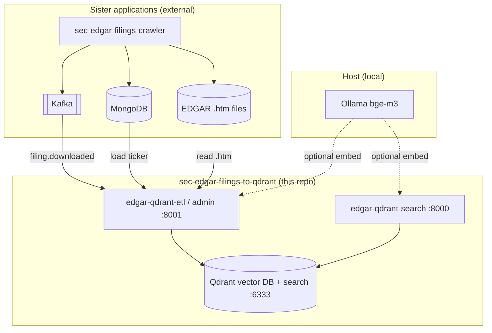
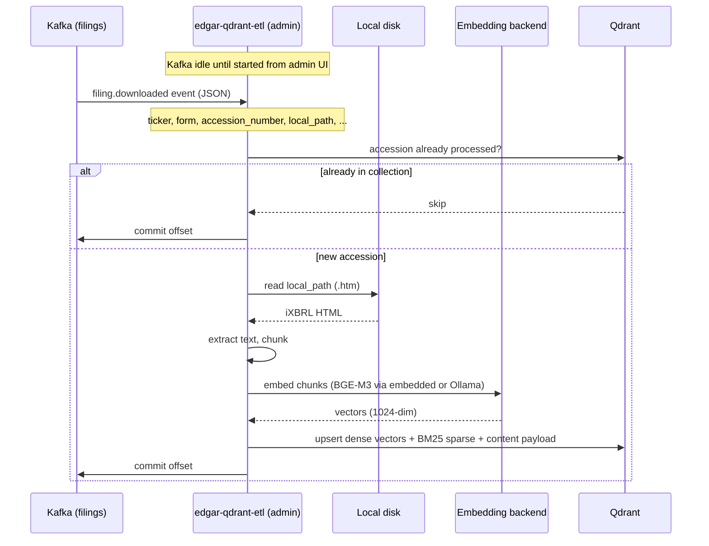
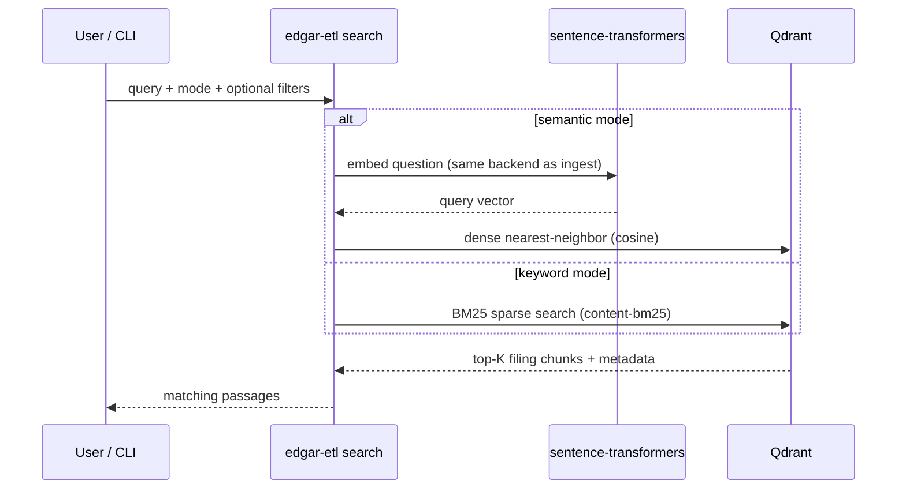
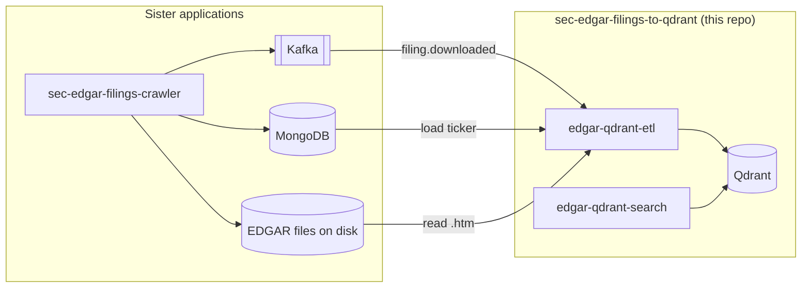

# SEC EDGAR Filings → Qdrant

Transform and load SEC EDGAR filings into [Qdrant](https://qdrant.tech/) for semantic and keyword search.

This service listens to Kafka for `filing.downloaded` events, reads filings from **`SEC_EDGAR_DOCUMENT_ROOT`** on the local filesystem (it does not download from SEC), extracts text from inline XBRL HTML, generates embeddings, and stores **dense vectors + BM25 sparse vectors** in Qdrant.

### Shared path conventions

| Concept | Meaning |
|---------|---------|
| **`SEC_EDGAR_DOCUMENT_ROOT`** | Host directory for downloaded filing `.htm` files (same path in crawler + consumer stacks) |
| **`LOCAL_DATA_ROOT`** | Parent directory for bind-mounted data (Qdrant storage, HF cache, config, etc.) |
| **`QDRANT_DATA_PATH`** | Qdrant vector DB files (`${LOCAL_DATA_ROOT}/qdrant-data` by default) |
| **`QDRANT_SEARCH_DATA_PATH`** | Search service local data — HuggingFace model cache (`${LOCAL_DATA_ROOT}/qdrant-search-data`) |

In `.env`, set `SEC_EDGAR_DOCUMENT_ROOT=${LOCAL_DATA_ROOT}/edgar-filings` (see `.env.example`). This repo maps it to `EDGAR_DATA_DIR` and `EDGAR_HOST_PATH`.

Companion project: [sec-edgar-filings-to-pgvector](https://github.com/sanjuthomas/sec-edgar-filings-to-pgvector) (same pipeline and web UIs, PostgreSQL + pgvector backend).

Licensed under the [MIT License](LICENSE).

## Application scope

**This repository is responsible for:**

| Owned by this app | Description |
|-------------------|-------------|
| **Application code** | ETL pipeline, admin UI, search UI, CLI (`edgar-etl`) |
| **Qdrant vector DB** | `edgar-qdrant` container — collection `filing_chunks`, dense `dense` vectors |
| **Qdrant vector search** | Semantic search (cosine on dense vectors) + keyword search (BM25 on `content-bm25`) via search UI and API |

**Runs locally on the host (not in this compose file):**

| Tool | Role |
|------|------|
| **[Ollama](https://ollama.com/)** | Optional embedding backend (`bge-m3`) when admin/search use **Ollama — BGE-M3** instead of in-process sentence-transformers |

**Provided by sister applications** (this repo connects to them; does not deploy or manage them):

| Sister app | What it provides |
|------------|------------------|
| [sec-edgar-filings-crawler](https://github.com/sanjuthomas/sec-edgar-filings-crawler) | SEC downloads, filing `.htm` files on disk, MongoDB metadata, Kafka `filings` topic |
| [sec-edgar-filings-to-pgvector](https://github.com/sanjuthomas/sec-edgar-filings-to-pgvector) | Parallel consumer — Postgres + pgvector instead of Qdrant |



All Docker services in **this** compose file share an external network with the crawler (default: `sec-edgar_default`) so the ETL container can reach `kafka:9092` and `mongo:27017` by hostname.

## Quick start (Docker)

**1. Start the producer stack** (Kafka, Mongo, downloader) from [sec-edgar-filings-crawler](https://github.com/sanjuthomas/sec-edgar-filings-crawler):

```bash
git clone https://github.com/sanjuthomas/sec-edgar-filings-crawler.git
cd sec-edgar-filings-crawler
cp .env.example .env   # set SEC_USER_AGENT
docker compose up -d --build
docker compose --profile jobs run --rm download-sp500   # optional: fetch filings
```

**2. Start this consumer stack** (Qdrant + ETL admin + search UI):

```bash
git clone https://github.com/sanjuthomas/sec-edgar-filings-to-qdrant.git
cd sec-edgar-filings-to-qdrant
cp .env.example .env   # set LOCAL_DATA_ROOT and paths (see Configuration)
mkdir -p "${LOCAL_DATA_ROOT:-./local-data}"/{qdrant-data,qdrant-search-data/hf-cache,hf-cache,config,edgar-filings}
docker compose up -d --build qdrant
# wait until Qdrant is healthy, then:
docker compose up -d --build edgar-qdrant-search
docker compose up -d --build edgar-qdrant-etl
docker compose run --rm edgar-qdrant-etl edgar-etl init-collection   # first time only
docker compose ps
```

Or start all three at once: `docker compose up -d --build`.

**3. Verify**

```bash
open http://localhost:8000                  # search UI (semantic + keyword)
open http://localhost:8001                  # admin UI (Kafka, load ticker, embedding backend)
open http://localhost:6333/dashboard        # Qdrant dashboard
```

In the **admin UI**, start Kafka consumption when you are ready (ETL does not auto-consume on startup). See [Web UIs](#web-uis) for what each interface is for.

## Data flow

This service consumes events produced by [sec-edgar-filings-crawler](https://github.com/sanjuthomas/sec-edgar-filings-crawler)
after filings are downloaded to local disk. It does not call SEC EDGAR directly.

### Ingest (Kafka → Qdrant)



### Query (semantic + keyword search)



## What this project does / does not do

| In scope (**this repo**) | Out of scope (sister apps / host) |
|----------|--------------|
| Application code — ETL, admin UI, search UI, CLI | Download filings from SEC EDGAR |
| Qdrant vector DB (`edgar-qdrant`) | Kafka broker |
| Qdrant vector search — dense + BM25 | MongoDB |
| Read `.htm` files from shared disk mount | Crawler / downloader |
| Consume Kafka events (read-only client) | LLM chat / RAG answers |
| Optional use of host Ollama for embeddings | Deploy or manage Ollama (runs on your machine) |

**Kafka, Mongo, and filing downloads** come from [sec-edgar-filings-crawler](https://github.com/sanjuthomas/sec-edgar-filings-crawler). **Ollama** runs on the host when you choose the Ollama embedding backend.

## Architecture



Both stacks join the same Docker network (`sec-edgar_default`, created by the crawler) so `edgar-qdrant-etl` can reach `kafka` and `mongo` by service name.

## Prerequisites

- **Docker** with Compose v2
- **[sec-edgar-filings-crawler](https://github.com/sanjuthomas/sec-edgar-filings-crawler)** running — provides `kafka`, `mongo`, and downloaded filings
- Shared filing directory mounted into the ETL container (see `EDGAR_HOST_PATH` in `.env`)
- Optional: **[Ollama](https://ollama.com/)** on the host with `bge-m3` pulled, if you use the Ollama embedding backend (`OLLAMA_BASE_URL=http://host.docker.internal:11434` from Docker)

### What runs where

| Service | Owner | Container | Purpose |
|---------|-------|-----------|---------|
| Kafka | sister app (crawler) | `kafka` | `filings` topic — ETL consumes as read-only client |
| MongoDB | sister app (crawler) | `mongo` | Filing metadata for admin **Load ticker** |
| Ollama | **host (local)** | — | Optional embeddings via `host.docker.internal:11434` |
| Qdrant vector DB | **this repo** | `edgar-qdrant` | Vector store + BM25 inference ([docs](https://qdrant.tech/documentation/search/text-search/)) |
| ETL + Admin | **this repo** | `edgar-qdrant-etl` | [Admin UI](http://localhost:8001): Kafka control, truncate, load ticker, embedding backend |
| Qdrant vector search | **this repo** | `edgar-qdrant-search` | [Search UI](http://localhost:8000): semantic + keyword search + JSON API |

**Host access:**

| UI / API | URL | Purpose |
|----------|-----|---------|
| Search UI | http://localhost:8000 | Chunk search (semantic + BM25), active embedding backend shown in stats |
| Admin UI | http://localhost:8001 | Connectivity, truncate collection, load ticker, pick embedding backend, start/stop Kafka |
| Qdrant dashboard | http://localhost:6333/dashboard | Inspect `filing_chunks` collection, points, and indexes |
| Qdrant REST API | http://localhost:6333 | Programmatic access (used by ETL and search UI) |
| Qdrant gRPC | localhost:6334 | gRPC client access |

Data is persisted under **`LOCAL_DATA_ROOT`** (see `.env.example`):

| Host path | Used by | Purpose |
|-----------|---------|---------|
| `${LOCAL_DATA_ROOT}/qdrant-data` | `edgar-qdrant` | Qdrant vector DB storage (`QDRANT_DATA_PATH`) |
| `${LOCAL_DATA_ROOT}/qdrant-search-data` | `edgar-qdrant-search` | Search HF model cache (`HF_HOME=/data/hf-cache`) |
| `${LOCAL_DATA_ROOT}/hf-cache` | `edgar-qdrant-etl` | ETL HuggingFace model cache |
| `${LOCAL_DATA_ROOT}/config` | ETL + search | Shared `embedding-backend.json` |
| `${LOCAL_DATA_ROOT}/edgar-filings` | ETL (read-only) | Filing `.htm` files (`SEC_EDGAR_DOCUMENT_ROOT`) |

Example local layout: `/Users/you/work/sec-edgar-local-test/` with the subdirectories above.

### Local filing storage (`SEC_EDGAR_DOCUMENT_ROOT`)

**Filing content always comes from the local filesystem**, not from Kafka. Kafka only provides metadata and processing triggers; the ETL opens and reads the `.htm` file at `local_path`.

Files are downloaded to disk by [sec-edgar-filings-crawler](https://github.com/sanjuthomas/sec-edgar-filings-crawler). This project mounts that same directory read-only into the `edgar-qdrant-etl` container at the **identical path**, so `local_path` values in Kafka events work inside Docker without translation.

Ensure Docker can read the host directory configured for `SEC_EDGAR_DOCUMENT_ROOT`.

Paths must stay under `EDGAR_DATA_DIR` (same value as `SEC_EDGAR_DOCUMENT_ROOT` in `.env`).

## Installation (local dev, optional)

For offline commands (`process-file`, `search`, `standby`, tests) without running the full stack in Docker:

```bash
git clone https://github.com/sanjuthomas/sec-edgar-filings-to-qdrant.git
cd sec-edgar-filings-to-qdrant

python3 -m venv .venv
source .venv/bin/activate
pip install -e ".[dev]"

cp .env.example .env
# Override for host-side dev (crawler still provides kafka/mongo):
#   QDRANT_URL=http://localhost:6333
#   KAFKA_BOOTSTRAP_SERVERS=localhost:9092
#   MONGO_URI=mongodb://localhost:27017

docker compose up -d qdrant
docker compose run --rm edgar-qdrant-etl edgar-etl init-collection
edgar-etl standby --port 8001    # admin UI
edgar-etl serve --port 8000      # search UI (separate terminal)
```

## Configuration

Copy `.env.example` to `.env`:

```env
# Network created by sec-edgar-filings-crawler docker compose
SEC_EDGAR_DOCKER_NETWORK=sec-edgar_default

# Local bind-mount root
LOCAL_DATA_ROOT=/path/to/your/sec-edgar-data

# Qdrant + search data directories (under LOCAL_DATA_ROOT)
QDRANT_DATA_PATH=${LOCAL_DATA_ROOT}/qdrant-data
QDRANT_SEARCH_DATA_PATH=${LOCAL_DATA_ROOT}/qdrant-search-data
HF_CACHE_HOST_PATH=${LOCAL_DATA_ROOT}/hf-cache

SEC_EDGAR_DOCUMENT_ROOT=${LOCAL_DATA_ROOT}/edgar-filings
EDGAR_DATA_DIR=${SEC_EDGAR_DOCUMENT_ROOT}
EDGAR_HOST_PATH=${SEC_EDGAR_DOCUMENT_ROOT}
# Comma-separated — do not use a JSON array here
ALLOWED_FORMS=10-K,10-Q,10-K/A,10-Q/A,8-K,8-K/A

QDRANT_URL=http://localhost:6333
QDRANT_COLLECTION=filing_chunks

# MongoDB — runs in sec-edgar-filings-crawler compose
MONGO_URI=mongodb://mongo:27017
MONGO_DB=sec_edgar_filings
MONGO_FILING_METADATA_COLLECTION=filing_metadata

# Read-only — services run in sec-edgar-filings-crawler
KAFKA_BOOTSTRAP_SERVERS=kafka:9092
KAFKA_TOPIC=filings
KAFKA_GROUP_ID=edgar-qdrant-etl
KAFKA_AUTO_OFFSET_RESET=earliest

# Embedding (1024 dimensions for BGE-M3)
EMBEDDING_MODEL=BAAI/bge-m3
EMBEDDING_BACKEND=embedded
EMBEDDING_CONFIG_PATH=/app/config/embedding-backend.json
OLLAMA_BASE_URL=http://host.docker.internal:11434
OLLAMA_EMBEDDING_MODEL=bge-m3
EMBEDDING_DEVICE=cpu
EMBEDDING_MAX_SEQ_LENGTH=512
EMBEDDING_BATCH_SIZE=16
EMBEDDING_DIMENSION=1024

CHUNK_SIZE=1000
CHUNK_OVERLAP=150

LOG_LEVEL=INFO
```

| Variable | Description |
|----------|-------------|
| `SEC_EDGAR_DOCKER_NETWORK` | Docker network from crawler compose (default: `sec-edgar_default`) |
| `LOCAL_DATA_ROOT` | Host directory for shared config and service bind mounts (Docker) |
| `QDRANT_DATA_PATH` | Qdrant storage on the host (default: `${LOCAL_DATA_ROOT}/qdrant-data`) |
| `QDRANT_SEARCH_DATA_PATH` | Search service data on the host (default: `${LOCAL_DATA_ROOT}/qdrant-search-data`) |
| `HF_CACHE_HOST_PATH` | ETL HuggingFace model cache on the host (default: `${LOCAL_DATA_ROOT}/hf-cache`) |
| `QDRANT_URL` | Qdrant REST API URL |
| `QDRANT_COLLECTION` | Collection name for filing chunks |
| `MONGO_URI` / `MONGO_DB` / `MONGO_FILING_METADATA_COLLECTION` | MongoDB for admin **Load ticker** |
| `SEC_EDGAR_DOCUMENT_ROOT` | Host directory for filing `.htm` files (typically `${LOCAL_DATA_ROOT}/edgar-filings`) |
| `EDGAR_DATA_DIR` | Same as `SEC_EDGAR_DOCUMENT_ROOT`; used by the ETL to resolve `local_path` |
| `EDGAR_HOST_PATH` | Host bind-mount path for Docker (Compose only; defaults to `EDGAR_DATA_DIR`) |
| `ALLOWED_FORMS` | Comma-separated forms to process (others are skipped). Use `10-K,10-Q,...` — **not** a JSON array |
| `KAFKA_BOOTSTRAP_SERVERS` | Kafka broker — **read-only consumer**; broker runs in sec-edgar-filings-crawler |
| `KAFKA_TOPIC` | Topic to consume (default in crawler: `filings`) |
| `KAFKA_GROUP_ID` | Consumer group for offset tracking |
| `KAFKA_AUTO_OFFSET_RESET` | `earliest` = start from offset 0 for new groups |
| `EMBEDDING_MODEL` | Hugging Face model for **embedded** backend (1024 dimensions for bge-m3) |
| `EMBEDDING_BACKEND` | Default backend if no config file: `embedded` or `ollama` |
| `EMBEDDING_CONFIG_PATH` | Shared JSON file read by ETL (:8001) and search UI (:8000); set from admin UI |
| `OLLAMA_BASE_URL` / `OLLAMA_EMBEDDING_MODEL` | Ollama `/api/embed` when backend is `ollama` |
| `EMBEDDING_DEVICE` / `EMBEDDING_MAX_SEQ_LENGTH` / `EMBEDDING_BATCH_SIZE` | Embedded model runtime |
| `EMBEDDING_DIMENSION` | Dense vector size (must match collection; 1024 for bge-m3) |
| `CHUNK_SIZE` / `CHUNK_OVERLAP` | Text splitting parameters |

### Embedding backends

Both ingest and search use the **same active backend**, persisted to `EMBEDDING_CONFIG_PATH` (shared volume in Docker):

| Backend | Label | How it works |
|---------|-------|----------------|
| `embedded` | Embedded — BGE-M3 | `sentence-transformers` in-process (`BAAI/bge-m3`) |
| `ollama` | Ollama — BGE-M3 | Host Ollama at `OLLAMA_BASE_URL`, model `OLLAMA_EMBEDDING_MODEL` |

Switch backends from the [admin UI](#admin-ui) (**Apply backend**). **Load ticker** requires an explicit backend choice each time (defaults to **Select backend**). The search UI stats bar shows the active backend.

## CLI commands

All commands are run via `edgar-etl`. In Docker:

```bash
docker compose run --rm edgar-qdrant-etl edgar-etl init-collection
docker compose up -d                                    # Qdrant + admin (:8001) + search (:8000)
docker compose run --rm edgar-qdrant-etl edgar-etl search "revenue growth" --top-k 5
docker compose run --rm edgar-qdrant-etl edgar-etl consume --group-id edgar-qdrant-etl-replay
```

Locally:

```bash
edgar-etl init-collection                         # Create collection + indexes
edgar-etl standby --port 8001                    # Admin UI (Kafka idle until started in browser)
edgar-etl serve --port 8000                       # Search UI
edgar-etl consume                                 # CLI Kafka consumer (always-on)
edgar-etl consume --group-id edgar-qdrant-etl-replay     # Replay topic from offset 0
edgar-etl process-event --json path/to.json       # Process one event offline
edgar-etl process-file --file ... --ticker ...    # Process one local file
edgar-etl search "your question" --top-k 5                    # Semantic (default)
edgar-etl search "director election" --mode keyword --top-k 5 # Keyword (BM25)
edgar-etl status                                  # Point count in collection
```

### Kafka consumer

**Docker default:** `edgar-qdrant-etl` runs `edgar-etl standby` and serves the admin UI on port **8001**. Kafka consumption is **off until you start it** from the admin UI (choose committed / earliest / latest offset).

For a headless always-on consumer (no admin UI), override the container command:

```bash
docker compose run --rm edgar-qdrant-etl edgar-etl consume
```

CLI `consume` connects immediately:

```bash
edgar-etl consume
```

- Commits Kafka offsets **only after** successful embed + Qdrant write
- Skips filings already in the collection (by `accession_number`)
- Use `--force` on `process-event` / `process-file` to reprocess

#### Replay the entire topic

Kafka tracks offsets per **consumer group**. To read from the beginning, pass a **new** group name that has never consumed the topic:

```bash
edgar-etl consume --group-id edgar-qdrant-etl-replay
```

Each new `--group-id` starts at the earliest offset (`KAFKA_AUTO_OFFSET_RESET=earliest` by default). Already-loaded filings are skipped unless you also pass `--force`:

```bash
edgar-etl consume --group-id edgar-qdrant-etl-replay --force
```

You can also set the default group in `.env` instead of using the flag:

```env
KAFKA_GROUP_ID=edgar-qdrant-etl-replay
```

### Process a single filing (no Kafka)

```bash
edgar-etl process-event --json examples/sample-event.json
```

```bash
edgar-etl process-file \
  --file "${SEC_EDGAR_DOCUMENT_ROOT}/AEE/000110465926063184/tm2614913d1_8k.htm" \
  --ticker AEE \
  --company-name "AMEREN CORP" \
  --form 8-K \
  --accession-number 0001104659-26-063184 \
  --filing-date 2026-05-14
```

## Kafka event format

```json
{
  "event_type": "filing.downloaded",
  "schema_version": 1,
  "ticker": "A",
  "company_name": "AGILENT TECHNOLOGIES, INC.",
  "filing_date": "2026-06-01",
  "form": "10-Q",
  "accession_number": "0001090872-26-000055",
  "local_path": "${SEC_EDGAR_DOCUMENT_ROOT}/A/000109087226000055/a-20260430.htm",
  "document_url": "https://www.sec.gov/Archives/edgar/data/1090872/000109087226000055/a-20260430.htm",
  "downloaded_at": "2026-06-16T17:28:23.652799Z"
}
```

## Qdrant schema

Single collection **`filing_chunks`** — one point per text chunk. Unlike [sec-edgar-filings-to-pgvector](https://github.com/sanjuthomas/sec-edgar-filings-to-pgvector), which uses separate Postgres tables `filings` and `filing_chunks`, Qdrant stores a **document-style (denormalized) model**: each point is a chunk with vectors plus a payload that repeats filing-level fields (`accession_number`, `ticker`, `form`, `chunk_count`, etc.). Filing count in the admin UI is derived by faceting distinct `accession_number` values — there is no separate `filings` collection to truncate.

| Payload field | Description |
|---------------|-------------|
| `content` | Text chunk |
| `accession_number`, `chunk_index` | Stable identity (UUID point id derived from these) |
| `ticker`, `company_name`, `form`, `filing_date` | From Kafka event |
| `local_path`, `document_url` | File location and SEC URL |
| `section` | ITEM header when detected |
| `chunk_count`, `processed_at` | Filing-level metadata on each point |

Each chunk is stored with **two indexes** (mirroring [sec-edgar-filings-to-pgvector](https://github.com/sanjuthomas/sec-edgar-filings-to-pgvector)):

| Index | Qdrant field | pgvector equivalent | Purpose |
|-------|--------------|---------------------|---------|
| Dense embeddings | `dense` vector (1024-dim, cosine) | `filing_chunks.embedding` (pgvector HNSW) | Semantic search |
| Keyword / BM25 | `content-bm25` sparse vector + `content` payload | `filing_chunks.content` (ParadeDB BM25) | Keyword search |
| Filing metadata | Repeated on every point payload | `filings` table (one row per accession) | Accession-level fields; no separate Qdrant collection |

Keyword payload indexes on `accession_number`, `ticker`, and `form`. A **full-text index** on `content` enables lexical filters ([Qdrant text search](https://qdrant.tech/documentation/search/text-search/)).

On ingest, each upsert writes:
- **Dense vector** from the active embedding backend (`embedded` or `ollama`)
- **BM25 sparse vector** via Qdrant server-side inference (`Qdrant/bm25` model on chunk text)
- **Payload** including full `content` text

The `qdrant/qdrant` image (v1.15+) runs BM25 inference in-process — no separate inference container is required.

If you change `EMBEDDING_MODEL` or `EMBEDDING_DIMENSION`, drop and recreate the Qdrant collection (or use a new `QDRANT_COLLECTION` name) before re-indexing. Run `edgar-etl init-collection` after recreating a collection to apply payload indexes.

## Web UIs

Docker Compose starts three browser interfaces. Use them together: the **Qdrant dashboard** confirms points landed; the **admin UI** controls ingest and embedding settings; the **search UI** verifies retrieval.

### Search UI

**URL:** [http://localhost:8000](http://localhost:8000)  
**Service:** `edgar-qdrant-search` (container `edgar-qdrant-search`)

Chunk-level search over filing text with two modes:

- **Semantic (dense vectors)** — embed the question and find nearest chunks by cosine similarity
- **Keyword (BM25)** — match query terms against chunk text via Qdrant sparse vectors

The page shows:

- **Filing count**, **chunk count**, **BM25 ready**, and **active embedding backend**
- A search form with **mode**, optional **ticker** and **form** filters
- **Top-K** results (default 10) with similarity or BM25 rank, accession number, chunk index, and passage text
- Link to the admin UI on port 8001

Start locally without Docker:

```bash
pip install -e ".[api]"
edgar-etl serve
# open http://127.0.0.1:8000
```

| Endpoint | Description |
|----------|-------------|
| `GET /` | Search web UI |
| `GET /api/stats` | `{ filing_count, chunk_count, bm25_ready, embedding_backend, embedding_model }` |
| `GET /api/search?q=...&mode=semantic&top_k=10&ticker=AEE&form=10-Q` | Semantic search JSON API |
| `GET /api/search?q=...&mode=keyword&top_k=10` | Keyword (BM25) search JSON API |

Returns source **chunks**, not LLM-generated answers. For full Q&A, retrieve chunks here (or via CLI) and pass them to an LLM separately.

### Admin UI

**URL:** [http://localhost:8001](http://localhost:8001)  
**Service:** `edgar-qdrant-etl` (container `edgar-qdrant-etl`, command `edgar-etl standby`)

Operational console modeled on [sec-edgar-filings-to-pgvector](https://github.com/sanjuthomas/sec-edgar-filings-to-pgvector):

| Section | What it does |
|---------|----------------|
| **Connectivity** | Qdrant, BM25 sparse vector, MongoDB, Kafka status |
| **Embedding backend** | Switch between **Embedded — BGE-M3** and **Ollama — BGE-M3** (shared with search UI) |
| **Collection schema** | Dense + sparse vectors and payload fields for `filing_chunks` |
| **Truncate** | Delete and recreate the `filing_chunks` collection (all points removed — there is only one truncatable target) |
| **Load ticker** | Fetch filings for a ticker from MongoDB; **must** pick an embedding backend and at least one form (10-Q / 10-K / 8-K); embed and upsert to Qdrant |
| **Kafka consumption** | Start/stop consumer; offset mode: committed, earliest, or latest |

**Load ticker** defaults:

- **Embedding backend** — placeholder **Select backend** (required; not pre-filled from the active backend)
- **Filing forms** — all checkboxes unchecked; pick at least one of 10-Q, 10-K, or 8-K before loading

Start locally:

```bash
pip install -e ".[api]"
edgar-etl standby --port 8001
# open http://127.0.0.1:8001
```

| Endpoint | Description |
|----------|-------------|
| `GET /` | Admin web UI |
| `GET /api/admin/status` | Stats, connectivity, embedding config, Qdrant BM25 info, schema, Kafka state |
| `POST /api/admin/embedding-backend` | `{ "backend": "embedded" \| "ollama" }` |
| `POST /api/admin/truncate` | `{ "table": "filing_chunks" }` |
| `POST /api/admin/load-ticker` | `{ "ticker": "KKR", "forms": ["10-K","10-Q"], "backend": "embedded" }` |
| `POST /api/admin/kafka/start` | `{ "offset": "committed" \| "earliest" \| "latest" }` |
| `POST /api/admin/kafka/stop` | Stop the background Kafka consumer |

### Qdrant dashboard

**URL:** [http://localhost:6333/dashboard](http://localhost:6333/dashboard)  
**Service:** `qdrant` (container `edgar-qdrant`)

Built-in [Qdrant](https://qdrant.tech/) console for inspecting the vector store:

- Open the **`filing_chunks`** collection to see point count and configuration
- Browse individual points and payload fields (`content`, `ticker`, `form`, `accession_number`, etc.)
- Verify keyword indexes on `accession_number`, `ticker`, and `form`
- Monitor cluster health and storage under **Collections**

Useful when debugging ingest (are points being upserted?) or comparing raw stored payloads with search results.

## Querying

### Semantic search

Embed your question with the **same embedding backend** used at load time, then find the nearest chunks.

```bash
edgar-etl search "Who was elected director at Ameren?" --ticker AEE --top-k 5
edgar-etl search "revenue growth" --form 10-Q --top-k 10
edgar-etl search "executive compensation approval"
```

**`--top-k N`** returns the **N most similar** chunks (CLI default: 5; [search UI](#search-ui) default: 10). Higher `score` / lower `distance` = better match.

### Keyword search (BM25)

Match exact terms and phrases without embedding the query:

```bash
edgar-etl search "director election" --mode keyword --top-k 5
edgar-etl search "Item 1A risk factors" --mode keyword --form 10-K
```

Higher **rank** = better BM25 match. Requires a collection created with `edgar-etl init-collection` (includes the `content-bm25` sparse vector).

### Full Q&A with an LLM

The [search UI](#search-ui) and CLI return source passages, not a synthesized answer. For natural-language answers:

1. Retrieve chunks with `edgar-etl search`
2. Send chunks + question to an LLM (Ollama, OpenAI, etc.)

## Project layout

```
sec-edgar-filings-to-qdrant/
├── LICENSE                    # MIT License
├── Dockerfile                 # ETL + admin + search image
├── docker-compose.yml         # Qdrant + edgar-qdrant-etl (admin) + edgar-qdrant-search
├── docker-compose.override.yml # Local volume overrides (auto-loaded)
├── pyproject.toml
├── .env.example
├── examples/sample-event.json
├── src/edgar_etl/
│   ├── cli.py                 # CLI entry point (standby, serve, consume, …)
│   ├── consumer.py            # CLI Kafka consumer
│   ├── kafka_manager.py       # Admin-managed Kafka consumer
│   ├── admin_api.py           # FastAPI admin UI + JSON API
│   ├── admin_service.py       # Truncate, load ticker, embedding config
│   ├── connectivity.py        # Startup checks (Qdrant, Mongo, Kafka)
│   ├── embedding_runtime.py   # Embedded vs Ollama backend selection
│   ├── ollama_embed.py        # Ollama /api/embed client
│   ├── mongo.py               # MongoDB filing metadata
│   ├── extract.py             # iXBRL HTML extraction + chunking
│   ├── embed.py               # Embedding dispatch (embedded / Ollama)
│   ├── store.py               # Qdrant upsert + truncate
│   ├── query.py               # Semantic + keyword search
│   ├── qdrant_search.py       # BM25 readiness helpers
│   ├── api.py                 # FastAPI search UI + JSON API
│   ├── static/index.html      # Search web UI
│   ├── static/admin.html      # Admin web UI
│   └── pipeline.py            # Orchestration
└── tests/
```

## Tech stack

| Layer | Library |
|-------|---------|
| Kafka | confluent-kafka |
| MongoDB | pymongo |
| HTML parsing | BeautifulSoup + lxml |
| Embeddings | sentence-transformers (`BAAI/bge-m3`) or Ollama (`bge-m3`) |
| Vector DB | qdrant-client (`qdrant/qdrant:v1.18.2`) |
| Web UI | FastAPI + uvicorn |
| Config | pydantic-settings |

## Tests

```bash
pytest
```

Extraction tests use a sample 8-K under `${SEC_EDGAR_DOCUMENT_ROOT}` if available locally.

## Troubleshooting

| Problem | Fix |
|---------|-----|
| `network sec-edgar_default not found` | Start [sec-edgar-filings-crawler](https://github.com/sanjuthomas/sec-edgar-filings-crawler) first: `docker compose up -d` |
| ETL can't reach Kafka / Mongo | Confirm crawler is running; check `SEC_EDGAR_DOCKER_NETWORK=sec-edgar_default` matches `docker network ls` |
| No filings ingesting after `docker compose up` | Expected — open [admin UI](http://localhost:8001) and **Start consumption** |
| `Connection refused` on Qdrant | Run `docker compose up -d` here and check `docker compose ps`; open [dashboard](http://localhost:6333/dashboard) |
| Search UI shows 0 filings/chunks | Start Kafka from admin UI or run `edgar-etl consume`; confirm collection in [Qdrant dashboard](http://localhost:6333/dashboard) |
| Load ticker skips all filings (`processed 0, skipped N`) | Check `ALLOWED_FORMS` is comma-separated in `.env` / compose — a JSON array like `["10-K",...]` is parsed incorrectly and every form is treated as unsupported |
| Load ticker fails | Set `MONGO_URI` and ensure MongoDB is running in sec-edgar-filings-crawler; pick an embedding backend and at least one filing form in the admin UI |
| Admin UI changes not visible | Static HTML is baked into the Docker image — run `docker compose up -d --build edgar-qdrant-etl` (or copy `admin.html` into the running container) |
| Ollama backend fails | Run Ollama on the host, `ollama pull bge-m3`, and verify `OLLAMA_BASE_URL` (Docker: `host.docker.internal:11434`) |
| Semantic search mismatch | Search and ingest must use the same backend — check admin UI **Embedding backend** and search UI stats |
| `filing not found` | Path outside `SEC_EDGAR_DOCUMENT_ROOT` / `EDGAR_DATA_DIR`; crawler and ETL must share the same mount; check Docker file sharing for your chosen host path |
| Poor search results | Use the same embedding backend for load and search; recreate collection after dimension/backend changes |
| Reprocess a filing | `edgar-etl process-event --json ... --force` or **Load ticker** in admin UI |
| Clear all indexed data | Admin UI **Truncate** or `edgar-etl init-collection` after manual collection delete |
| Replay Kafka from start | Admin UI → Kafka → **Earliest**, or `edgar-etl consume --group-id <new-name>` |
| Replay and re-embed all filings | Add `--force` to the replay command, or truncate collection first |

## License

This project is licensed under the MIT License — see [LICENSE](LICENSE).
